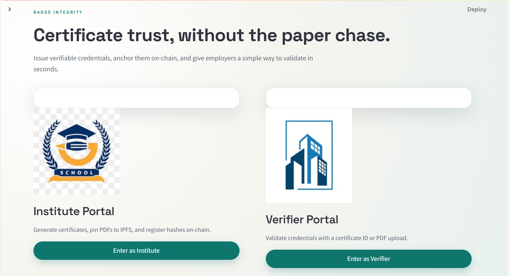
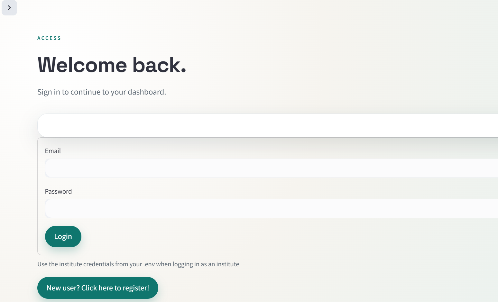
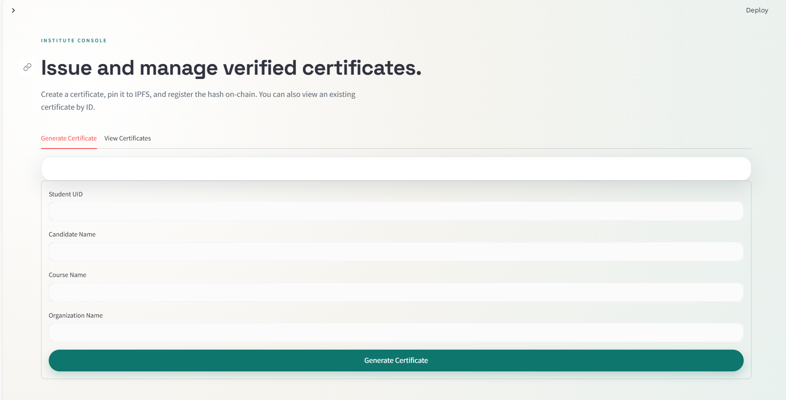
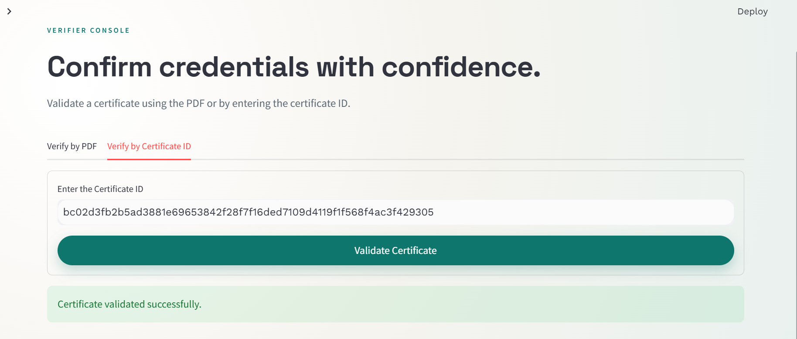
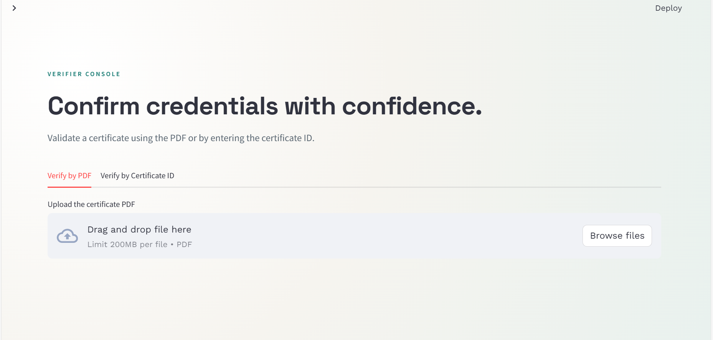
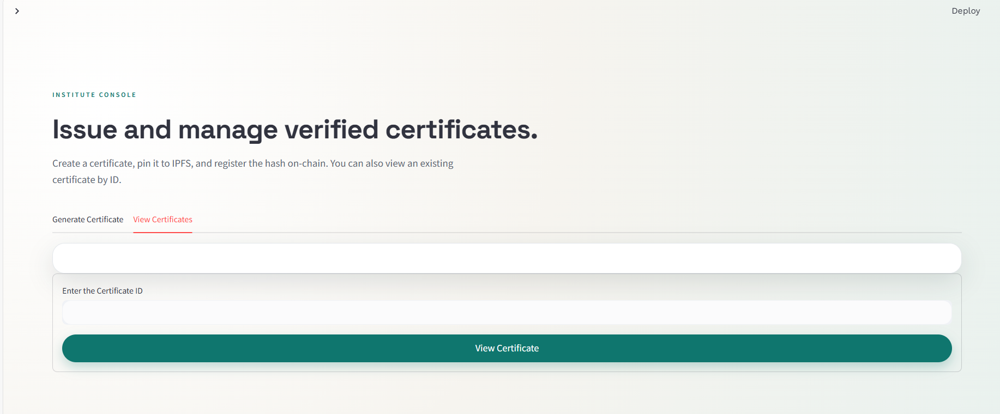
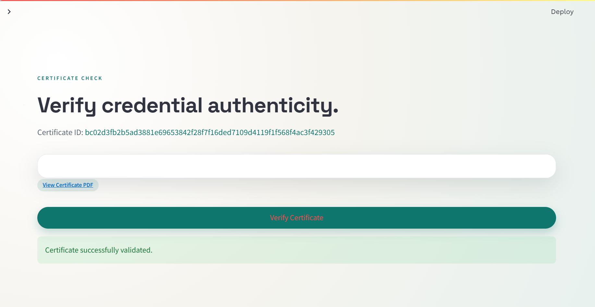

# Badge Integrity 🚀

> 🏆 Hackathon-born project, refined into a production-ready showcase of Web3 skills.

Badge Integrity is a Streamlit-based certificate validation system built around a simple market need: a single, trusted company that verifies the integrity of certifications and badges issued by many organizations. Instead of each issuer building their own validation pipeline, they can outsource this problem to one verifier that uses blockchain guarantees (immutability, decentralization, tamper resistance) to keep credential integrity transparent and auditable. Institutes issue credentials, the app auto-generates a certificate PDF from the institute inputs, and verifiers validate by ID or PDF, with hashes anchored on-chain and certificates stored on IPFS via Pinata.

This repository is currently a prototype and does not include a backend database; all state lives on-chain (for hashes/metadata) and in IPFS (for PDFs).

---

✨ **Why Pinata?**  
Pinata was chosen for its reliability and straightforward developer tooling. For a demo that depends on fetching certificates quickly during verification, predictable IPFS availability matters more than running a local pinning node.

## Technologies Used
- Python 3.13 + Streamlit UI
- Solidity smart contracts (Truffle / solc 0.8.13)
- Web3.py for on-chain reads/writes
- Ganache (local Ethereum dev chain)
- Pinata IPFS gateway for certificate storage

### Tooling Notes (for less common tools)
- **Truffle**: A smart contract build + deployment framework. It compiles Solidity, manages migrations, and writes the ABI/artifacts your UI needs.
- **Ganache**: A local Ethereum blockchain simulator. It provides fast accounts with test ETH and lets you iterate without paying gas.

### Smart Contract Summary
The `Certification` contract stores a certificate record keyed by a deterministic certificate ID (a SHA‑256 hash of the certificate fields). It exposes:
- `generateCertificate(...)` to store a certificate and emit an event.
- `getCertificate(id)` to fetch the stored metadata and IPFS hash.
- `isVerified(id)` to check if a certificate exists.

## Architecture
- `contracts/` contains the Solidity contract (`Certification.sol`).
- `migrations/` deploys the contract and writes the address to `deployment_config.json`.
- `build/contracts/` stores the compiled ABI/bytecode artifacts.
- `application/` is the Streamlit UI:
  - `application/connection.py` loads the ABI, deployment address, and Web3 provider.
  - `application/pages/` contains the Institute and Verifier workflows.
  - `application/auth/` contains a local dummy auth store (no Firebase).

## Screenshots 📸

### Shared areas
Home / role selection


Login page (verifier and institute)


### Institute
Institute flow

Verification page




View and generate certificates


### Verifier
Credential authenticity check


## How To Run

### 1) Prerequisites
- Python 3.13
- Node.js + npm
- Ganache (UI or CLI)

### 2) Start a local blockchain
Run Ganache on `http://127.0.0.1:8545`.

### 3) Compile and deploy the contract
From the repo root:
```bash
npx truffle compile
npx truffle migrate --reset
```
This updates `build/contracts/` and `deployment_config.json`.

### 4) Configure environment variables
Copy the example file and fill in values:
```bash
cp .env.example .env
```
Required:
- `PINATA_API_KEY`
- `PINATA_API_SECRET`
- `institute_email`
- `institute_password`
- `verifier_email`
- `verifier_password`

Optional:
- `WEB3_PROVIDER_URI` (defaults to `http://127.0.0.1:8545`)
- `PINATA_SSL_VERIFY=false` if your network uses a self-signed TLS proxy

### 5) Install Python dependencies
```bash
python3 -m venv venv
source venv/bin/activate
pip install -r requirements.txt
```

### 6) Run the app
```bash
python3 -m streamlit run application/app.py
```

### 7) End-to-end flow
- Institute login → generate certificate → save share link with `cert_id`.
- Verifier login → validate by ID or PDF.

## Web Endpoints
These are the Streamlit page routes once the app is running:
- `/` — Home / role selection
- `/login` — Login for institute or verifier
- `/register` — Verifier registration (dummy auth)
- `/institute` — Institute dashboard (issue/view certificates)
- `/verifier` — Verifier dashboard (validate by PDF or ID)
- `/verify_certificate` — Public verification view for a share link (`?cert_id=...&ipfs_hash=...`)

## Contributions
Contributions are welcome. Please:
- Open an issue describing the change or bug.
- Create a feature branch and keep commits focused.
- Include a short test plan (manual steps are fine).
